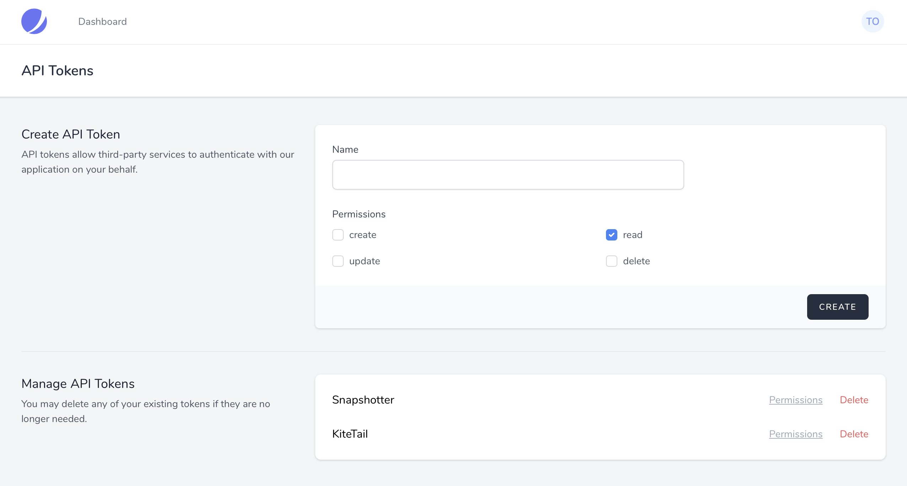

# API

[[toc]]

## Introduction

Jetstream includes first-party integration with [Laravel Sanctum](https://laravel.com/docs/sanctum). Laravel Sanctum provides a featherweight authentication system for SPAs (single page applications), mobile applications, and simple, token based APIs. Sanctum allows each user of your application to generate multiple API tokens for their account. These tokens may be granted abilities / permissions which specify which actions the tokens are allowed to perform.



By default, the API token creation panel may be accessed using the "API" link of the top-right user profile dropdown menu. From this screen, users may create Sanctum API tokens that have various permissions.

::: tip
For more information on Sanctum and to learn how to issue requests to a Sanctum authenticated API, please consult the official [Sanctum documentation](https://laravel.com/docs/sanctum).
:::

## Defining Permissions

The permissions available to API tokens are defined using the `Jetstream::permissions` method within your application's `JetstreamServiceProvider`:

```php
Jetstream::defaultApiTokenPermissions(['read']);

Jetstream::permissions([
    'create',
    'read',
    'update',
    'delete',
]);
```

The `defaultApiTokenPermissions` method may be used to specify which permissions should be selected by default when creating a new API token. Of course, a user may uncheck a default permission before creating the token.

## Authorizing Incoming Requests

Every request made to your Jetstream application, even to authenticated routes within your `routes/web.php` file, will be associated with a Sanctum token object. You may determine if the associated token has a given permission using the `tokenCan` method provided by the `Laravel\Sanctum\HasApiTokens` trait. This trait is automatically applied to your application's `App\Models\User` model during Jetstream's installation:

```php
$request->user()->tokenCan('read');
```

#### First-Party UI Initiated Requests

When a user makes a request to a route within your `routes/web.php` file, the request will typically be authenticated by Sanctum through a cookie based `web` guard. Since the user is making a first-party request through the application UI in this scenario, the `tokenCan` method will always return `true`.

## Disabling API Support

If your application will not be offering an API to third-parties, you can disable Jetstream's API feature entirely. To do so, you should comment out the relevant entry in the `features` configuration option of the `config/jetstream.php` configuration file:

```php
'features' => [
    Features::profilePhotos(),
    // Features::api(),
    Features::teams(),
],
```
