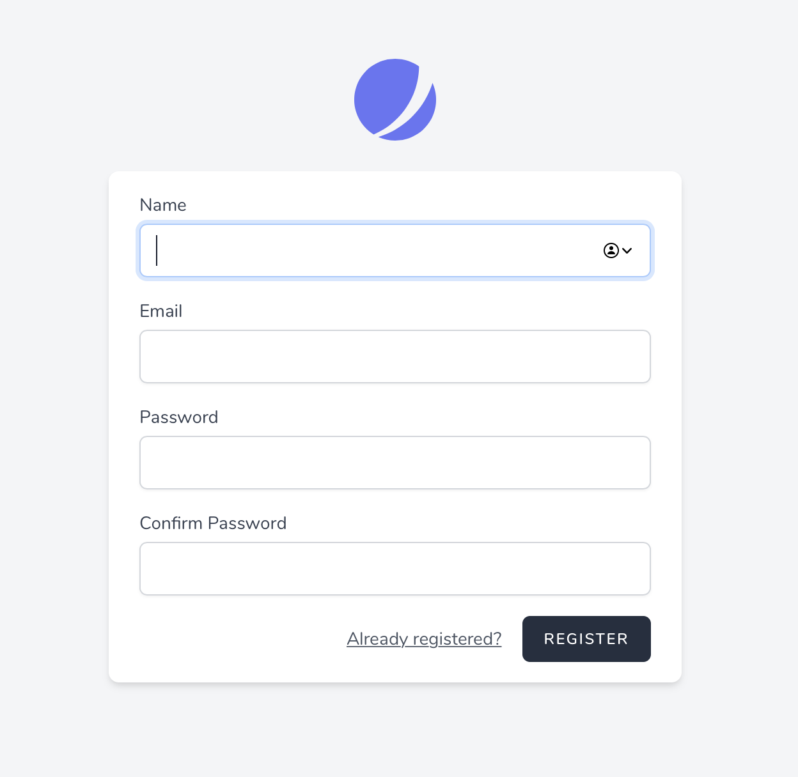

# Authentication

[[toc]]

## Introduction

Laravel Jetstream automatically scaffolds the login, two-factor login, registration, password reset, and email verification features for your project, allowing you to start building the features you care about instead of worrying about the nitty-gritty details of user authentication.



## Laravel Fortify

Under the hood, the authentication portions of Jetstream are powered by [Laravel Fortify](https://github.com/laravel/fortify), which is a front-end agnostic authentication backend for Laravel. Essentially, Fortify defines the routes and controllers for implementing the application's authentication features while the Jetstream UI makes requests to those routes.

When Jetstream is installed, the `config/fortify.php` configuration file is installed into your application. Within this configuration file, you can customize various aspects of Fortify's behavior, such as the authentication guard that should be used, where users should be redirected after authentication, and more.

Within the `fortify` configuration file, you can also disable entire features of Fortify, such as the ability to update profile information or passwords.

## Views / Pages

When using the Livewire stack, the login view is displayed using the `resources/views/auth/login.blade.php` Blade template. When using the Inertia stack, this view is displayed using the `resources/js/Pages/Auth/Login.vue` template. The directories that contain these views also contain other authentication related views / pages for your application.

### Customizing The Authentication Views

Laravel Jetstream will automatically render the proper views for your application's login and other authentication screens. However, sometimes you may wish to customize how a particular authentication view is rendered or the data that is received by the view.

All of the authentication view's rendering logic may be customized using the appropriate methods available via the `Laravel\Fortify\Fortify` class. Typically, you should call this method from the `boot` method of your application's `App\Providers\JetstreamServiceProvider` class:

```php
use Laravel\Fortify\Fortify;

/**
 * Bootstrap any application services.
 *
 * @return void
 */
public function boot()
{
    Fortify::loginView(function () {
        return view('auth.login');
    });
}
```

#### Customizing Inertia Authentication Views

If your application is using the Inertia stack, you may return Inertia pages from your view customization closures:

```php
use Illuminate\Support\Facades\Route;
use Inertia\Inertia;
use Laravel\Fortify\Fortify;

Fortify::loginView(function () {
    return Inertia::render('Auth/Login', [
        'canResetPassword' => Route::has('password.request'),
        'status' => session('status'),
    ]);
});
```

## Customizing The Authentication Process

### Customizing User Authentication

Sometimes, you may wish to have full customization over how user credentials are authenticated and how users are retrieved from your application's database. Thankfully, Jetstream allows you to easily accomplish this using the `Fortify::authenticateUsing` method.

The `authenticateUsing` method accepts a closure that receives the incoming HTTP request. The closure is responsible for validating the login credentials attached to the request and returning the associated user instance. If the credentials are invalid or no user can be found, `null` or `false` should be returned by the closure. Typically, this method should be called from the `boot` method of your `JetstreamServiceProvider`:

```php
use App\Models\User;
use Illuminate\Http\Request;
use Illuminate\Support\Facades\Hash;
use Laravel\Fortify\Fortify;

/**
 * Bootstrap any application services.
 *
 * @return void
 */
public function boot()
{
    // ...

    Fortify::authenticateUsing(function (Request $request) {
        $user = User::where('email', $request->email)->first();

        if ($user &&
            Hash::check($request->password, $user->password)) {
            return $user;
        }
    });
}
```

If you prefer to encapsulate your custom authentication process within a class instead of a closure, you may pass a PHP "callable" array to the `authenticateUsing` method:

```php
use App\Actions\AuthenticateLoginAttempt;
use Laravel\Fortify\Fortify;

Fortify::authenticateUsing([new AuthenticateLoginAttempt, '__invoke']);
```

### Customizing The Authentication Pipeline

Laravel Fortify, which is Jetstream's underlying authentication library, authenticates login requests through a pipeline of invokable classes.

If you would like, you may define a custom pipeline of classes that login requests should be piped through. Each class should have an `__invoke` method which receives the incoming `Illuminate\Http\Request` instance and, like middleware, a `$next` variable that is invoked in order to pass the request to the next class in the pipeline.

To define your custom pipeline, you may use the `Fortify::authenticateThrough` method. This method accepts a closure which should return the array of classes to pipe the login request through. Typically, this method should be called from the `boot` method of your `App\Providers\JetstreamServiceProvider` class.

The example below contains the default pipeline definition that you may use as a starting point when making your own modifications:

```php
use Laravel\Fortify\Actions\AttemptToAuthenticate;
use Laravel\Fortify\Actions\EnsureLoginIsNotThrottled;
use Laravel\Fortify\Actions\PrepareAuthenticatedSession;
use Laravel\Fortify\Actions\RedirectIfTwoFactorAuthenticatable;
use Laravel\Fortify\Fortify;
use Illuminate\Http\Request;

Fortify::authenticateThrough(function (Request $request) {
    return array_filter([
            config('fortify.limiters.login') ? null : EnsureLoginIsNotThrottled::class,
            RedirectIfTwoFactorAuthenticatable::class,
            AttemptToAuthenticate::class,
            PrepareAuthenticatedSession::class,
    ]);
});
```
