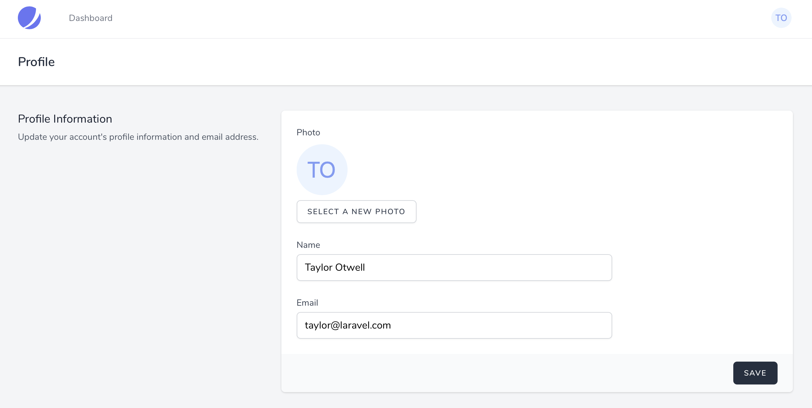

# Profile Management

[[toc]]

## Introduction

Laravel Jetstream's profile management features are accessed by the user using the top-right user profile navigation dropdown menu. Jetstream scaffolds views and actions that allow the user to update their name, email address, and, optionally, their profile photo.

## Views / Pages

When using the Livewire stack, this view is displayed using the `resources/views/profile/update-profile-information-form.blade.php` Blade template. when using the Inertia stack, this view is displayed using the `resources/js/Pages/Profile/UpdateProfileInformationForm.vue` template.

Each of these templates will receive the entire authenticated user object so that you can add additional fields to these forms as necessary. Any additional inputs added to the forms will be included in the `$input` array that is passed to your `UpdateUserProfileInformation` action.

## Actions

As typical of most Jetstream features, the logic executed to satisfy profile update requests can be found in an action class within your application. Specifically, the `App\Actions\Fortify\UpdateUserProfileInformation` class will be invoked when the user updates their profile.

Therefore, any customizations you wish to make to this logic should be made in this class. The action receives the currently authenticated `$user` and an array of `$input` that contains all of the input from the incoming request, including the updated profile photo if applicable.
